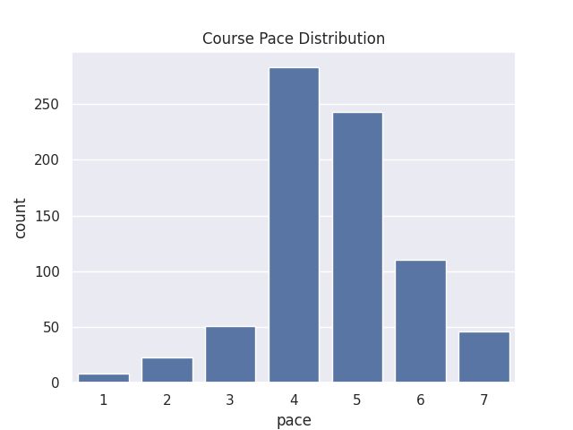
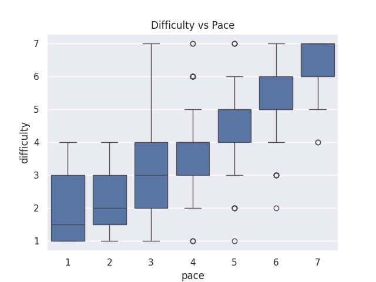
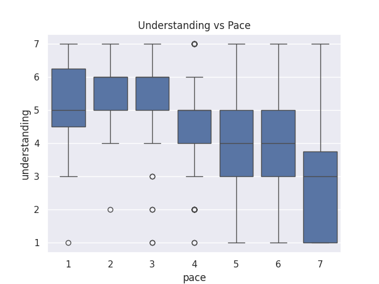

---
# Do not edit the text between these lines!
layout: default
---

## I analyzed how course pace affects student difficulty and understanding using survey data.

<!-- This is a comment. Below, you'll see code for inserting an image. To make this image appear, update <custom-path>. To add an image, save it inside the imgs folder of this repository. -->

## Conclusion

My analysis for this exercise suggests that the pace of COMP110 may have a meaningful impact on student learning and takweways. Based on the visualizations, students who perceive the course as moving more quickly tend to report higher levels of difficulty and also sometimes lower levels of understanding. This supports my idea that slowing the pace of the course could improve the learning experience for certain students, particularly those who are struggling to keep up. I would recommend exploring ways to effectively better manage the pace of the course, including adding more review days, incorporating additional group practice, or offering optional materials that allow students to reinforce concepts at their own speed. Rather than fully slowing the course for all students, a more flexible approach may provide the most value to the entire section. However, there're important trade-offs to consider. Slowing the pace may reduce the amount of content that can be covered during the semester, which would disadvantage students who are prepared for a faster pace courseor who are relying on the course for future classes. Additionally, you may face increased workload in redesigning every lecture, assignment, or support materials. As a result, stakeholders such as advanced students or instructional staff could be negatively impacted. Future work could extend this analysis by studying how pacing directly impacts quiz scores, assignment performance, or course completion rates. It would also be helpful to collect more  data on how different types of students are impacted by course pace. Overall, while the data is not perfectly conclusive, it provides reasonable evidence that pacing is an important factor in student success and is worth further exploring for potential adjustment.